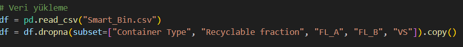
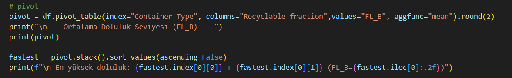
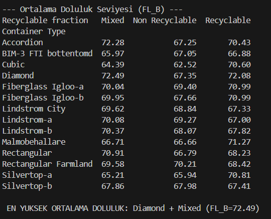
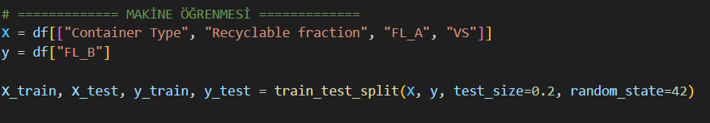
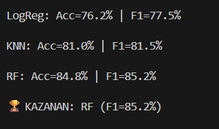
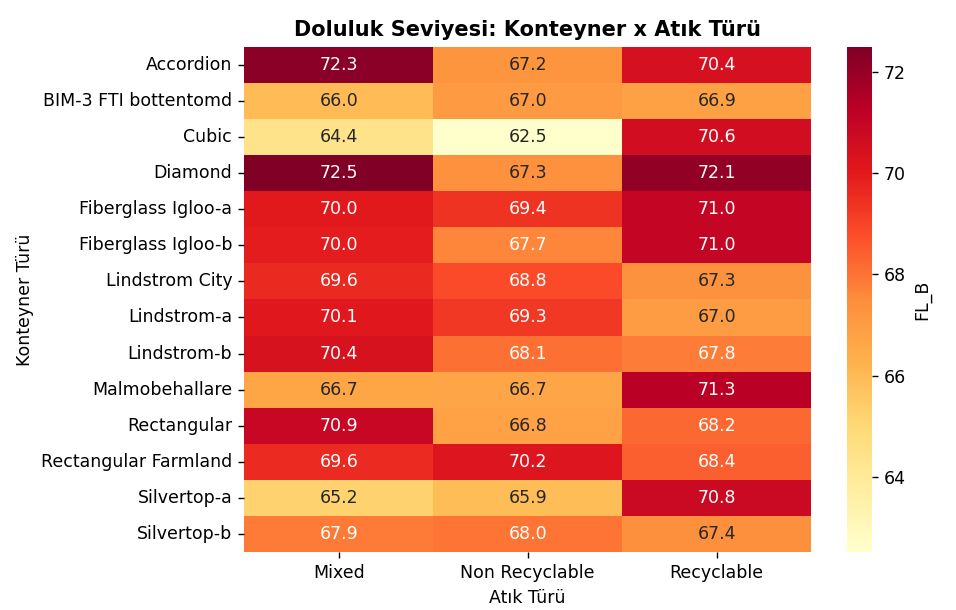
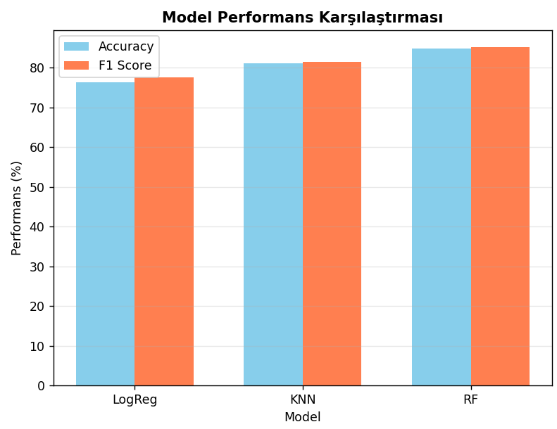

# Makine Öğrenmesi Projesi

Bu projede Smart_Bin.csv veri seti kullanılarak konteynerlerin doluluk durumları incelenmiştir.

İlk olarak pivot analiz ile angi konteyner türünün,hangi atık türünde,ortalama olarak daha dolu olduğu
görülmeye çalışılmıştır.

Daha sonra makine öğrenmesi kullanılarak, konteynerlerin doluluk durumunun yüksek mi düşük mü olacağı tahmin ettim .
Projede hem veri analizi hem de temel makine öğrenmesi yöntemleri birlikte kullandım.

## Veri Seti

 veri seti farklı konteyner türlerinin çeşitli atık türleriyle ne kadar dolduğunu gösteren bilgiler içermektedir.
veri setinde kullanılan temel sütunlar şunlardır:

 Container Type: Konteynerin türünü-modelini ifade eder 
 Recyclable fraction: Konteynerin aldığı atık türünü gösterir 
 FL_A: Ölçümün başındaki doluluk seviyesi
 FL_B: Ölçümün sonundaki doluluk seviyesi
 VS: Ölçümle ilgili sayısal bir değerdir ve makine öğrenmesi kısmında özellik (feature) olarak kullandım.

Eksik veya hatalı veriler analiz ve makine öğrenmesi aşamalarından önce veri setinden çıkarıldı.
Aşağıda veri temizlemeve veri okuma  işleminin kod üzerinde nasıl yapıldığı gösterilmekteyim:

## Pivot Analizi

Pivot tablo ile konteyner türü ve atık türüne göre ortalama doluluk seviyesini karşılaştırdım.
Burada amaç:
- Hangi konteyner + hangi atık türünde ortalama FL_B değeri daha yüksek görmek
Pivot tablosundan sonra en yüksek ortalamaya sahip birleşimde ekrana yazdırdım.

### Terminal çıktısı

## Makine Öğrenmesi 

Pivot analizden sonra ek olarak basit bir makine öğrenmesi denedim.
amaç:
- "FL_B" değeri "yüksek mi - düşük mü" tahmin etmek
bu yüzden:
- "FL_B" değerlerini medyana göre iki sınıfa ayırdım (median üstü = 1, altı = 0)

Modele verdiğim bilgiler:
Container Type
Recyclable fraction
FL_A
VS

Kullanılan algoritmalar:
Logistic Regression
KNN
Random Forest

### Koddan bir parça

### Model Eğitimi ve Seçim

Modelleri eğitmeden önce veriyi uygun formata getirmek için bir pipeline kullandım.  
"Container Type" ve "Recyclable fraction" gibi kategorik sütunlar **One-Hot Encoding** ile sayısal hale getirildi.  
"FL_A" ve "VS" ise StandardScaler ile ölçeklendirildi.
Daha sonra Logistic Regression, KNN ve Random Forest modelleri aynı eğitim/test ayrımı üzerinde çalıştırıldı.  
Her model için Accuracy ve F1 Score hesaplandı ve F1 Score en yüksek olan model kazanan olarak seçildi.

## Grafikler

Projede iki grafik oluşturdum:

- Isı haritası : Pivot tablosundaki ortalama FL_B değerlerini konteyner türü ve atık türüne göre görselleştirir. Renk koyulaştıkça ortalama doluluk seviyesi artar.
- Model karşılaştırma grafiği: Logistic Regression, KNN ve Random Forest modellerinin ccuracy ve F1 Score değerlerini yan yana karşılaştırır.

### Heatmap (Pivot Görselleştirme)

### Model Performans Grafiği

## Sonuçlar

 Pivot analiz ile konteyner türü ve atık türüne göre ortalama "FL_B" değerleri karşılaştırıldı ve en yüksek ortalamaya sahip kombinasyon belirlendi.
 makine öğrenmesi kullanılarak, konteynerlerin doluluk durumunun yüksek mi düşük mü olacağı tahmin ettim
 Logistic Regression, KNN ve Random Forest modelleri denenip Accuracy ve 1 Score ile karşılaştırıldı.
 Denemeler sonucunda en iyi performans gösteren model F1 Score değerine göre seçildi.

## Sertifikalar

